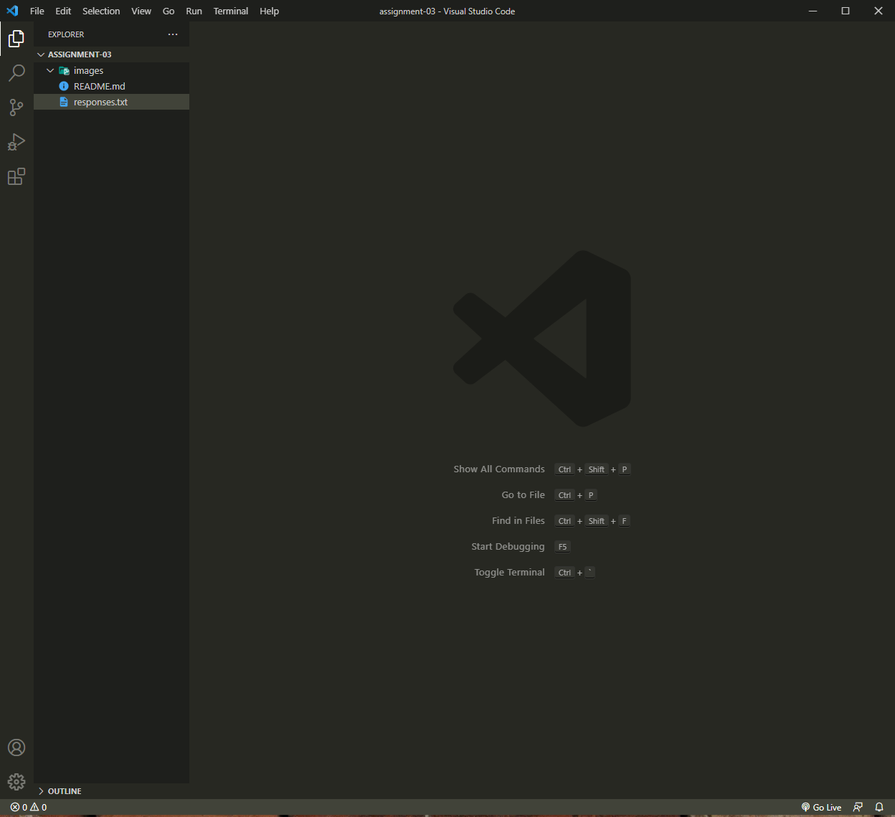

# Assignment 3

## Seth Walker

1. I learned the difference between the internet and the world wide web.

2. I learned about the DNS and how it relates to ip addresses.

3. I learned how to annotate documents in markdown. 

[Reddit](http://www.reddit.com)

[Responses](responses.txt)

