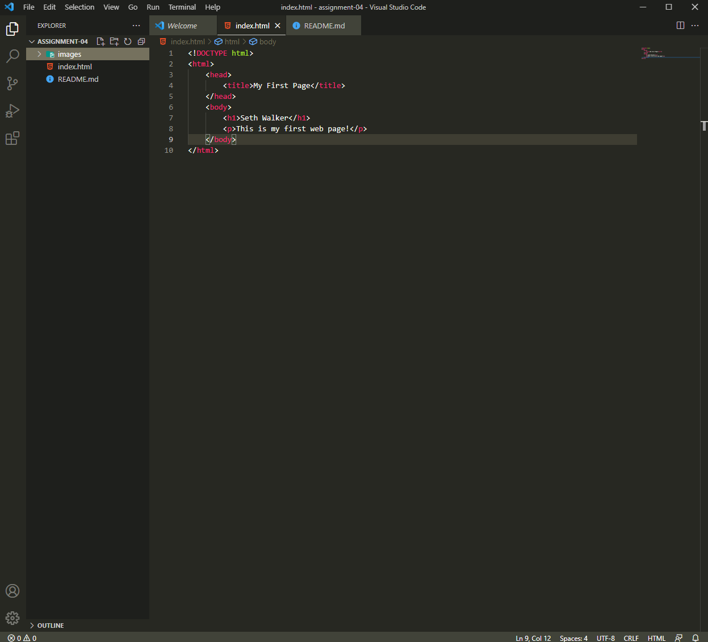

An internet browser communicates with the DOM to locate webservers and then reads and displays the HTML and JavaScript hosted by that server.

A markup language is a language used for annotating a document in order to make content more distinguishable. One you see all over the web is HTML. HTML allows for the organization of text you see on a typical web page. 

