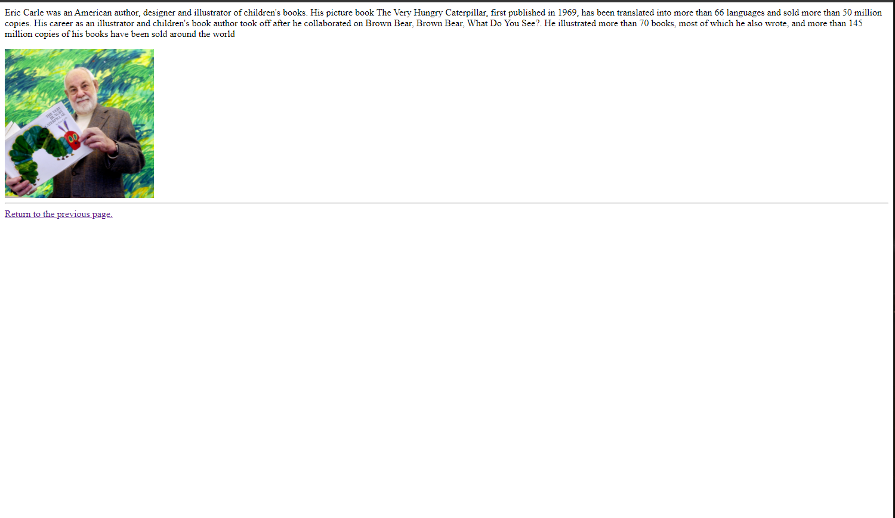

1. I went to the Domino's Pizza website in 1998 and it was real bare bones. There was no online ordering or even images of their pizzas. It was just a little ad talking about how they built a dominos in egypt and how pizza kind of looks like the pyramids. It's just an image of the sphynx smelling some pizza pyramids, some text, and a link to a page where you can sign up for their emailing list. This site really reflects how sites have a evolved from simple novelty to fundamental importance in the world of business.

2. I found these last few topics pretty straight forward because I already have a fair bit of experience with html, but It took me a little while to get github pages to work the way I wanted to, and that was a little frustrating. I also need to get comfortable with the github desktop app because I still prefer using the browser.

